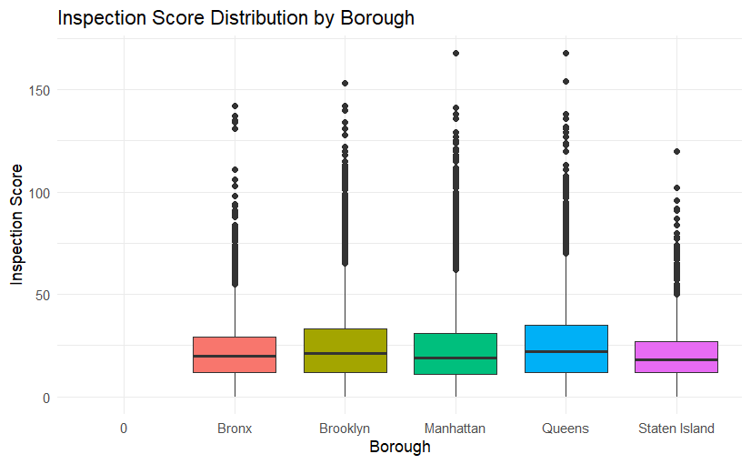

## Introduction

The New York City Department of Health and Mental Hygiene (DOHMH) is tasked with protecting public health by regularly inspecting food service establishments. These inspections evaluate key aspects of restaurant operations-including hygiene, food handling, and sanitation-to ensure compliance with city health codes (NYC DOHMH, 2023).

Given the diversity of restaurants across New York City’s five boroughs, each with its own operational characteristics and culinary traditions, inspection outcomes can vary significantly. Factors such as geographic location, cuisine type, and restaurant size may all influence compliance rates and the frequency of specific violations (Kim & Kim, 2019). Understanding these variations is essential for developing targeted interventions and policies to enhance food safety and public health.

The aim of this analysis is to examine publicly available restaurant inspection data from the NYC Department of Health and Mental Hygiene to identify patterns and trends in inspection results. Specifically, the analysis focuses on the distribution of inspection scores across different boroughs and cuisine types.

## Hypotheses:

1.  Inspection scores will differ across boroughs and be associated with differences in median income.

2.  Restaurants with higher risk profiles-such as those serving raw or undercooked ingredients-will have a higher incidence of critical violations.

## Data Description

This analysis uses two main data sets. The first contains detailed information about restaurant inspections, including restaurant name, location (borough, street, zipcode), cuisine type, inspection date, violation codes, scores, and grades. The data is longitudinal, with multiple inspections per restaurant. For this study, the focus is on the columns for borough, cuisine description, and inspection score to explore their relationships.

The second data set provides median income data across boroughs, sourced from the Citizens' Committee for Children of New York (2025). A bar chart illustrates the distribution of median income by borough for 2023.

For the first dataset, I will mostly use the data in column Boro, Cuisine Description, and Score. To investigate their relationship.

```{r}

library(tidyverse)
library(conflicted)
library(dplyr)
conflicts_prefer(dplyr::filter)


nyc_inspections <- read.csv("DOHMH_New_York_City_Restaurant_Inspection_Results.csv", stringsAsFactors = FALSE)
boroughincome <- read.csv("Median Incomes.csv", stringsAsFactors = FALSE)

five_boroughs <- c("Manhattan", "Queens", "Staten Island", "Brooklyn", "Bronx")

nyc_inspections$INSPECTION.DATE <- as.Date(nyc_inspections$INSPECTION.DATE, format = "%m/%d/%Y")
nyc_inspections$GRADE.DATE <- as.Date(nyc_inspections$GRADE.DATE, format = "%m/%d/%Y")

```

The second set of data is viewing the income data across Boroughs. According to Citizens' Committee for Children of New York(Citizens' Committee for Children of New York, 2025). The following bar chart show the income distribution through Boroughs

```{r}
library(dplyr)
library(ggplot2)


data_2023_all <- boroughincome %>%
  filter(TimeFrame == 2023,
         Household.Type == "All Households",
         Location %in% five_boroughs) %>%
  mutate(
    Data = as.numeric(Data), 
    Location = factor(Location, levels = five_boroughs)  
  )


ggplot(data_2023_all, aes(x = Location, y = Data, fill = Location)) +
  geom_bar(stat = "identity") +
  labs(title = "2023 Median Income for All Households in NYC Five Boroughs",
       x = "Borough",
       y = "Median Income (Dollars)") +
  theme_minimal() +
  theme(legend.position = "none",
        axis.text.x = element_text(angle = 45, hjust = 1))  


```


## Data Visualization

#### Plot inspection scores distribution by borough

```{r}
ggplot(nyc_inspections, aes(x = BORO, y = SCORE, fill = BORO)) +
geom_boxplot(alpha = 1) +
labs(title = "Inspection Score Distribution by Borough",
x = "Borough",
y = "Inspection Score") +
theme_minimal() +
theme(legend.position = "none")
```



A box plot of inspection scores by borough reveals that Queens has the highest mean score at 25.56, while Staten Island has the lowest at 21.17. The standard deviations are relatively high across all boroughs, ranging from approximately 15 to 19, indicating considerable variability in inspection scores within each borough.

```{r}

nyc_inspections_filtered <- nyc_inspections %>%
  filter(!is.na(SCORE))


borough_summary <- nyc_inspections_filtered %>%
  group_by(BORO) %>%
  summarise(
    Mean_Score = mean(SCORE, na.rm = TRUE),
    Median_Score = median(SCORE, na.rm = TRUE),
    SD_Score = sd(SCORE, na.rm = TRUE),
    Q1_Score = quantile(SCORE, 0.25, na.rm = TRUE),
    Q3_Score = quantile(SCORE, 0.75, na.rm = TRUE),
    Min_Score = min(SCORE, na.rm = TRUE),
    Max_Score = max(SCORE, na.rm = TRUE),
    Count = n()
  )

print(borough_summary)
```


The relationship between median income and mean inspection scores across the five boroughs is very weak and statistically insignificant. Linear regression analysis further shows that median income does not explain the variation in inspection scores. Therefore, Hypothesis 1 is not supported.

### Linear Regression of Inspection Score and Income by Borough

Ranking the boroughs from riskiest to safest based on mean inspection scores yields the order: Queens, Brooklyn, Manhattan, Bronx, and Staten Island. In contrast, the income ranking from lowest to highest is: Bronx, Brooklyn, Queens, Staten Island, and Manhattan. This comparison demonstrates that there is no direct correlation between borough income levels and restaurant inspection scores; higher-income boroughs do not necessarily have better inspection outcomes.

```{r}


library(ggplot2)


nyc_data <- data.frame(
  Borough = c("Manhattan", "Staten Island", "Queens", "Brooklyn", "Bronx"),
  Mean_Inspection_Score = c(23.53905, 21.16555, 25.56238, 24.60421, 22.85461),
  Median_Income = c(101078, 95543, 81929, 76912, 46838)
)


ggplot(nyc_data, aes(x = Median_Income, y = Mean_Inspection_Score, label = Borough)) +
  geom_point(size = 3, color = "blue") +
  geom_text(vjust = -1, hjust = 0.5) +
  labs(title = "Income vs Inspection Score by Borough",
       x = "Median Income (USD)",
       y = "Mean Inspection Score") +
  theme_minimal()


cor_test_result <- cor.test(nyc_data$Median_Income, nyc_data$Mean_Inspection_Score)
print(cor_test_result)


model <- lm(Mean_Inspection_Score ~ Median_Income, data = nyc_data)
summary(model)


```

```

	Pearson's product-moment correlation

data:  nyc_data$Median_Income and nyc_data$Mean_Inspection_Score
t = -0.16573, df = 3, p-value = 0.8789
alternative hypothesis: true correlation is not equal to 0
95 percent confidence interval:
 -0.9017381  0.8592219
sample estimates:
        cor 
-0.09525006 


Call:
lm(formula = Mean_Inspection_Score ~ Median_Income, data = nyc_data)

Residuals:
      1       2       3       4       5 
 0.1498 -2.2656  2.0283  1.0322 -0.9448 

Coefficients:
                Estimate Std. Error t value Pr(>|t|)   
(Intercept)    2.415e+01  3.772e+00   6.404  0.00771 **
Median_Income -7.562e-06  4.563e-05  -0.166  0.87891   
---
Signif. codes:  0 ‘***’ 0.001 ‘**’ 0.01 ‘*’ 0.05 ‘.’ 0.1 ‘ ’ 1

Residual standard error: 1.935 on 3 degrees of freedom
Multiple R-squared:  0.009073,	Adjusted R-squared:  -0.3212 
F-statistic: 0.02747 on 1 and 3 DF,  p-value: 0.8789

```


A correlation analysis confirms that the relationship between median income and mean inspection scores across the five boroughs is very weak and statistically insignificant. Linear regression analysis further shows that median income does not explain the variation in inspection scores. Therefore, Hypothesis 1 is not supported.

### Investigate another factor - Cuisines

#### Calculate average score by cuisine and plot top 10 cuisines with highest average scores

```{r}
# Calculate average scores and counts for each cuisine
avg_scores <- nyc_inspections %>%
  group_by(CUISINE.DESCRIPTION) %>%
  summarise(avg_score = mean(SCORE, na.rm = TRUE),
            count = n()) %>%
  filter(!is.na(CUISINE.DESCRIPTION) & CUISINE.DESCRIPTION != "") %>%
  arrange(desc(avg_score))

# Top 25 Cuisines by Average Inspection Score
top_25_cuisines <- avg_scores %>%
  slice_head(n = 25)

ggplot(top_25_cuisines, aes(x = reorder(CUISINE.DESCRIPTION, avg_score), y = avg_score, fill = avg_score)) +
  geom_col() +
  coord_flip() +
  labs(title = "Top 25 Cuisines by Average Inspection Score",
       x = "Cuisine",
       y = "Average Score") +
  scale_fill_gradient(low = "green", high = "red") +
  theme_minimal()

# Bottom 25 Cuisines by Average Inspection Score
bottom_25_cuisines <- avg_scores %>%
  slice_tail(n = 25)

ggplot(bottom_25_cuisines, aes(x = reorder(CUISINE.DESCRIPTION, avg_score), y = avg_score, fill = avg_score)) +
  geom_col() +
  coord_flip() +
  labs(title = "Bottom 25 Cuisines by Average Inspection Score",
       x = "Cuisine",
       y = "Average Score") +
  scale_fill_gradient(low = "red", high = "green") +
  theme_minimal()
```


The analysis of average inspection scores by cuisine reveals a considerable range, from a high of 37.04 for Bangladeshi cuisine to a low of 10.00 for both Chimichurri and Haute Cuisine. While the latter two cuisines have a limited number of samples, with single-digit figures, the donut category, which scores 14.28 and has a substantial sample size of 5120, further underscores the breadth of this range. This wide variation suggests that cuisine type is a strong predictor of inspection outcomes.

Cuisines such as Bangladeshi, African, and Egyptian tend to have higher average scores, indicating more violations. This may be due to their reliance on traditional cooking methods and on-site food preparation, which require meticulous hygiene and handling (Shukri et al., 2018). These cuisines often use fresh, unprocessed ingredients and complex cooking processes, increasing the risk of contamination if not managed properly. In contrast, cuisines like donuts and hamburgers rely more on pre-processed ingredients and simpler preparation methods, which can reduce certain types of violations.

### Prepare data for linear modeling

```{r}
library(tidyverse)
library(knitr)
library(kableExtra)
library(broom)

# 1. Prepare model as before
model_data <- nyc_inspections %>%
  mutate(
    BORO = factor(BORO),
    CUISINE.DESCRIPTION = factor(CUISINE.DESCRIPTION)
  ) %>%
  filter(!is.na(SCORE))  # Remove rows with missing SCORE

model <- lm(SCORE ~ BORO + CUISINE.DESCRIPTION, data = model_data)

# 2. Create and print a formatted table with kableExtra
model_summary <- summary(model)

# Tidy the coefficients for kable
coef_table <- tidy(model, conf.int = TRUE)

kable(coef_table, caption = "Model Coefficients", digits = 3) %>%
  kable_styling(bootstrap_options = c("striped", "hover", "condensed"))

# Show the full summary object as text for reference
print(model_summary)

# Prepare model as before
model_data <- nyc_inspections %>%
  mutate(
    BORO = factor(BORO),
    CUISINE.DESCRIPTION = factor(CUISINE.DESCRIPTION)
  ) %>%
  filter(!is.na(SCORE))

model <- lm(SCORE ~ BORO + CUISINE.DESCRIPTION, data = model_data)

# Extract coefficients from the model summary
coef_table <- broom::tidy(model)

# Format the table with kableExtra
kable(coef_table, caption = "Model Coefficients") %>%
  kable_styling(bootstrap_options = c("striped", "hover", "condensed"))


```

```
Call:
lm(formula = SCORE ~ BORO + CUISINE.DESCRIPTION, data = model_data)

Residuals:
    Min      1Q  Median      3Q     Max 
-37.553 -12.224  -3.832   7.738 146.776 

Coefficients:
                                                   Estimate Std. Error t value Pr(>|t|)    
(Intercept)                                        18.45714    1.39967  13.187  < 2e-16 ***
BOROBrooklyn                                        1.63381    0.13654  11.966  < 2e-16 ***
BOROManhattan                                       1.53774    0.13400  11.476  < 2e-16 ***
BOROQueens                                          2.21595    0.13778  16.083  < 2e-16 ***
BOROStaten Island                                  -0.70518    0.21937  -3.215 0.001307 ** 
CUISINE.DESCRIPTIONAfrican                         16.73689    1.48026  11.307  < 2e-16 ***
CUISINE.DESCRIPTIONAmerican                         1.97540    1.39718   1.414 0.157407    
CUISINE.DESCRIPTIONArmenian                         6.83796    2.48856   2.748 0.006001 ** 
CUISINE.DESCRIPTIONAsian/Asian Fusion               7.17435    1.41614   5.066 4.06e-07 ***
CUISINE.DESCRIPTIONAustralian                       3.23131    1.72865   1.869 0.061587 .  
CUISINE.DESCRIPTIONBagels/Pretzels                  3.29903    1.43861   2.293 0.021837 *  
CUISINE.DESCRIPTIONBakery Products/Desserts         4.25969    1.40499   3.032 0.002431 ** 
CUISINE.DESCRIPTIONBangladeshi                     16.88002    1.48808  11.343  < 2e-16 ***
CUISINE.DESCRIPTIONBarbecue                         2.29132    1.58261   1.448 0.147670    
CUISINE.DESCRIPTIONBasque                           7.50512    4.67447   1.606 0.108373    
CUISINE.DESCRIPTIONBottled Beverages               -2.03088    1.49333  -1.360 0.173840    
CUISINE.DESCRIPTIONBrazilian                        2.95053    1.72714   1.708 0.087576 .  
CUISINE.DESCRIPTIONCajun                            2.01142    2.35085   0.856 0.392212    
CUISINE.DESCRIPTIONCalifornian                      4.59095    3.17992   1.444 0.148817    
CUISINE.DESCRIPTIONCaribbean                        7.94718    1.40608   5.652 1.59e-08 ***
CUISINE.DESCRIPTIONChicken                          3.73549    1.41087   2.648 0.008106 ** 
CUISINE.DESCRIPTIONChilean                          9.56830    3.59481   2.662 0.007775 ** 
CUISINE.DESCRIPTIONChimichurri                    -10.67308   12.69496  -0.841 0.400498    
CUISINE.DESCRIPTIONChinese                          8.15847    1.39843   5.834 5.42e-09 ***
CUISINE.DESCRIPTIONChinese/Cuban                   12.38819    1.88709   6.565 5.22e-11 ***
CUISINE.DESCRIPTIONChinese/Japanese                 6.70883    1.59646   4.202 2.64e-05 ***
CUISINE.DESCRIPTIONCoffee/Tea                       1.22913    1.40087   0.877 0.380268    
CUISINE.DESCRIPTIONContinental                      4.79587    1.68862   2.840 0.004510 ** 
CUISINE.DESCRIPTIONCreole                          10.84279    1.65382   6.556 5.53e-11 ***
CUISINE.DESCRIPTIONCreole/Cajun                     8.14875    2.45494   3.319 0.000902 ***
CUISINE.DESCRIPTIONCzech                            5.25000    5.14172   1.021 0.307228    
CUISINE.DESCRIPTIONDonuts                          -5.52316    1.41742  -3.897 9.76e-05 ***
CUISINE.DESCRIPTIONEastern European                 9.17581    1.48941   6.161 7.25e-10 ***
CUISINE.DESCRIPTIONEgyptian                        13.87391    2.09151   6.633 3.29e-11 ***
CUISINE.DESCRIPTIONEnglish                         -2.89133    2.23134  -1.296 0.195052    
CUISINE.DESCRIPTIONEthiopian                        6.72287    1.96892   3.414 0.000639 ***
CUISINE.DESCRIPTIONFilipino                        13.71058    1.59600   8.591  < 2e-16 ***
CUISINE.DESCRIPTIONFrench                           2.76537    1.43697   1.924 0.054299 .  
CUISINE.DESCRIPTIONFrozen Desserts                  0.11147    1.43589   0.078 0.938123    
CUISINE.DESCRIPTIONFruits/Vegetables               -2.87630    3.11630  -0.923 0.356014    
CUISINE.DESCRIPTIONFusion                           9.35524    1.55002   6.036 1.59e-09 ***
CUISINE.DESCRIPTIONGerman                           0.17688    1.83448   0.096 0.923187    
CUISINE.DESCRIPTIONGreek                            2.44203    1.47532   1.655 0.097874 .  
CUISINE.DESCRIPTIONHamburgers                      -3.49055    1.42237  -2.454 0.014127 *  
CUISINE.DESCRIPTIONHaute Cuisine                   -9.99488    8.10161  -1.234 0.217320    
CUISINE.DESCRIPTIONHawaiian                        -1.90220    1.69917  -1.119 0.262931    
CUISINE.DESCRIPTIONHotdogs                         -2.13948    1.96283  -1.090 0.275715    
CUISINE.DESCRIPTIONHotdogs/Pretzels                 2.49390    1.88308   1.324 0.185380    
CUISINE.DESCRIPTIONIndian                          11.27749    1.41991   7.942 1.99e-15 ***
CUISINE.DESCRIPTIONIndonesian                       4.44750    2.29340   1.939 0.052470 .  
CUISINE.DESCRIPTIONIranian                          4.79891    3.11627   1.540 0.123573    
CUISINE.DESCRIPTIONIrish                            2.12700    1.45695   1.460 0.144318    
CUISINE.DESCRIPTIONItalian                          2.26365    1.40773   1.608 0.107833    
CUISINE.DESCRIPTIONJapanese                         4.81923    1.40700   3.425 0.000614 ***
CUISINE.DESCRIPTIONJewish/Kosher                    6.52201    1.42405   4.580 4.65e-06 ***
CUISINE.DESCRIPTIONJuice, Smoothies, Fruit Salads   3.72907    1.41924   2.628 0.008602 ** 
CUISINE.DESCRIPTIONKorean                           6.07133    1.42290   4.267 1.98e-05 ***
CUISINE.DESCRIPTIONLatin American                   6.63914    1.40395   4.729 2.26e-06 ***
CUISINE.DESCRIPTIONLebanese                         0.53538    2.54869   0.210 0.833621    
CUISINE.DESCRIPTIONMediterranean                    5.35218    1.42818   3.748 0.000179 ***
CUISINE.DESCRIPTIONMexican                          5.13246    1.40501   3.653 0.000259 ***
CUISINE.DESCRIPTIONMiddle Eastern                   5.85461    1.44435   4.053 5.05e-05 ***
CUISINE.DESCRIPTIONMoroccan                         7.78835    2.09567   3.716 0.000202 ***
CUISINE.DESCRIPTIONNew American                     2.84806    1.76384   1.615 0.106378    
CUISINE.DESCRIPTIONNew French                       3.37848    2.72714   1.239 0.215407    
CUISINE.DESCRIPTIONNot Listed/Not Applicable       -5.66067    2.72689  -2.076 0.037907 *  
CUISINE.DESCRIPTIONNuts/Confectionary               4.60512    4.22731   1.089 0.275990    
CUISINE.DESCRIPTIONOther                            1.87045    1.43090   1.307 0.191152    
CUISINE.DESCRIPTIONPakistani                        8.95248    1.61257   5.552 2.83e-08 ***
CUISINE.DESCRIPTIONPancakes/Waffles                 3.63804    1.65797   2.194 0.028216 *  
CUISINE.DESCRIPTIONPeruvian                         4.90883    1.50074   3.271 0.001072 ** 
CUISINE.DESCRIPTIONPizza                            3.78126    1.40154   2.698 0.006977 ** 
CUISINE.DESCRIPTIONPolish                           0.84393    1.96596   0.429 0.667726    
CUISINE.DESCRIPTIONPortuguese                       3.15169    2.25051   1.400 0.161384    
CUISINE.DESCRIPTIONRussian                          9.06910    1.59208   5.696 1.22e-08 ***
CUISINE.DESCRIPTIONSalads                          -3.19567    1.51977  -2.103 0.035490 *  
CUISINE.DESCRIPTIONSandwiches                       0.52647    1.41779   0.371 0.710392    
CUISINE.DESCRIPTIONSandwiches/Salads/Mixed Buffet   0.37114    1.47847   0.251 0.801789    
CUISINE.DESCRIPTIONScandinavian                    -0.01864    2.70998  -0.007 0.994513    
CUISINE.DESCRIPTIONSeafood                          3.70121    1.44566   2.560 0.010461 *  
CUISINE.DESCRIPTIONSoul Food                        6.75318    1.56252   4.322 1.55e-05 ***
CUISINE.DESCRIPTIONSoups                           -2.63515    3.24871  -0.811 0.417288    
CUISINE.DESCRIPTIONSoups/Salads/Sandwiches          0.13415    1.77909   0.075 0.939894    
CUISINE.DESCRIPTIONSoutheast Asian                  8.15993    1.49179   5.470 4.51e-08 ***
CUISINE.DESCRIPTIONSpanish                          6.82818    1.41053   4.841 1.29e-06 ***
CUISINE.DESCRIPTIONSteakhouse                       2.27828    1.52390   1.495 0.134906    
CUISINE.DESCRIPTIONTapas                            1.36029    1.70100   0.800 0.423887    
CUISINE.DESCRIPTIONTex-Mex                         -0.06889    1.43207  -0.048 0.961630    
CUISINE.DESCRIPTIONThai                             6.82719    1.42147   4.803 1.56e-06 ***
CUISINE.DESCRIPTIONTurkish                          7.25007    1.54423   4.695 2.67e-06 ***
CUISINE.DESCRIPTIONVegan                            4.22375    1.57337   2.685 0.007264 ** 
CUISINE.DESCRIPTIONVegetarian                       4.84840    1.55470   3.119 0.001818 ** 
---
Signif. codes:  0 ‘***’ 0.001 ‘**’ 0.01 ‘*’ 0.05 ‘.’ 0.1 ‘ ’ 1

Residual standard error: 17.84 on 262978 degrees of freedom
Multiple R-squared:  0.03797,	Adjusted R-squared:  0.03763 
F-statistic:   114 on 91 and 262978 DF,  p-value: < 2.2e-16
```


The linear model confirms that cuisine type has a much greater impact on inspection scores than borough. The model estimates that cuisine can account for score differences ranging from approximately -14.27 to 18.9 points, while borough accounts for only -0.7 to 2.2 points. This indicates that food handling practices associated with specific cuisines are more closely linked to inspection outcomes than neighborhood income levels.

## **Conclusion**

Hypothesis 1 is not supported, as no consistent relationship was found between inspection scores and median income across the boroughs. Conversely, Hypothesis 2 is supported: restaurants with higher risk profiles-such as those serving raw or undercooked foods-exhibit a greater incidence of critical violations. This suggests that food handling practices are a stronger determinant of inspection outcomes than the income levels of the neighborhoods in which restaurants are located.

## References

NYC Department of Health and Mental Hygiene. (2023). Restaurant inspection data. NYC Open Data Portal. Retrieved from <https://data.cityofnewyork.us/Health/DOHMH-New-York-City-Restaurant-Inspection-Results/43nn-pn8j/about_data>

Shukri, W. H. Z., Low, Y. P., & Rahijan, A. W. (2018). Ethnic cuisine structure and food handlers’ hygiene practices at rural Minangkabau and Terengganu homestays. Agriculture: Towards a Better Future, 104.

Citizens' Committee for Children of New York, Inc. (2025). Data download. Retrieved from <https://data.cccnewyork.org/data/download#0/66>

Kim, D., & Kim, S. (2019). Factors influencing food safety compliance in restaurants: A multi-level analysis. Food Control, 102, 1–8. <https://doi.org/10.1016/j.foodcont.2019.03.014>
